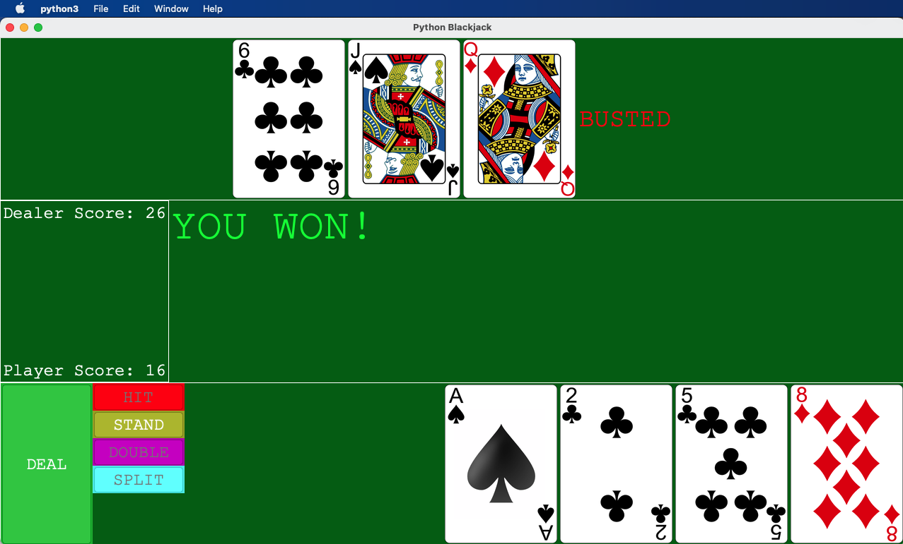

<h1>Python Game With Visual GUI</h1>

<h2>This is a blackjack game made with Python's TKinter module</h2>

# Instructions

    Dependencies:
    - Pillow module
        - classes: ImageTk, Image (download with pip)
    - Tkinter, os, random (Should be installed by default)

    run python3 main.py
     

